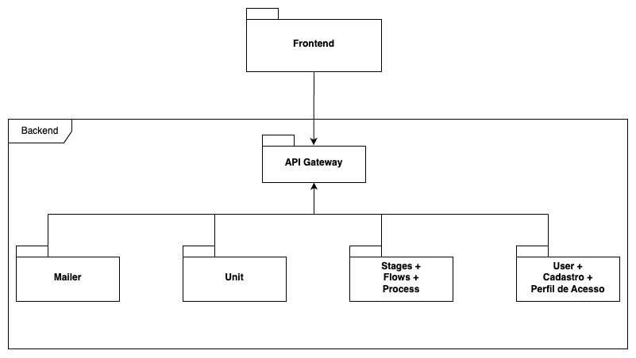

# CAPJu - Services

<div align="center">
  
</div>

## Sobre o Projeto

O CAPJu é abreviação para _"Controle e Acompanhamento de Processos da Justiça"_, no qual trata-se de uma projeto de código aberto que tem como objetivo ajudar os usuários da 4ª vara cível da Justiça Federal na realização de gerenciar os processos.

Este repositório contém o código-fonte do backend do projeto CAPJu, seguindo uma arquitetura de microserviços. Cada pasta neste repositório representa um serviço separado, permitindo a modularização e escalabilidade do sistema.

## Tecnologias

<div style="display: flex">


</div>

## Estrutura do repositório

- Serviço de Usuário (User): Serviço destinado a oferecer funcionalidades robustas e escaláveis para gerenciar a autenticação, autorização, listagem e perfis dos usuários.
- Serviço de Unidades (Unit):
- Serviço de Email (Mailer):

## Arquitetura

<div align="center">

</div>
## Instalação

### Configurando .env Global (Destinado para rodar o banco de dados no docker)

```
POSTGRES_DATABASE=
POSTGRES_PORT=
POSTRES_USER=
POSTGRES_PASSWORD=
```

### Configurando .env do serviço

```
DB_NAME=
DB_HOST=
DB_USER=
DB_PASSWORD=
DB_DIALECT=
DB_PORT=
USER_URL_API=
```

## NodeJs

Esse projeto conta com a versão 18 no [NodeJs](https://nodejs.org/en).

O [Node Version Manager](https://github.com/nvm-sh/nvm), mais comumente chamado de NVM, é a maneira mais popular de instalar várias versões do Nodejs. Essa tecnologia é recomendada para o desenvolvedor poder gerenciar diferentes versões do NodeJs conforme a necessidade do projeto.

## Execute o projeto localmente

Por conter uma arquitetura de microserviços, é necessário rodar cada serviço separadamente conforme a necessidade de uso.

```bash
# Para rodar o projeto pela primeira vez basta executar o comando:

nvm use 18

# Esse comendo irá defirnir a versão de desenvolvimento do NodeJs como 18

npm install

# Esse comendo irá instalar as bibliotecas

npm start

# Esse comando irá subir o servidor ocupando a porta 8080.
```

## Instalando Novas Dependecias

Pode ser utilizado o seguinte comando para inserir novas dependencias na aplicação:

```bash
npm install nome-da-dependencia
```

## Criando banco de dados

É utilizado um sistema de migrations para mantermos o banco de dados sempre atualizado:

Obs: Para rodar os comandos listados abaixo, é necessário a criação prévia da base de dados que terá o mesmo nome da variável DB_NAME encontrada no .env.

Obs: Pra executar esses comandos, se faz necessário a instalação da sequelize-cli como pacote externo.

```bash
npm install -g sequelize-cli

# Esse comando irá instalar a sequelize-cli de maneira global e irá permitir que você rode comandos com o npx.
```

```bash
npm run migration OU npx sequelize-cli db:migrate

# Esse comando irá rodar as migrations criando as tabelas no seu banco da dados.
```

Caso seja necessário remover a última migration, pode ser usado esse comando:

```bash

npm run shred OU npx sequelize-cli db:migrate:undo

# Esse comando irá remover a última migration criada.
```

## Formatação do código

A biblioteca [Prettier](https://prettier.io/) é a ferramente utilizada para adicionar a formatação padrão de código, e pode ser aplicada com o seguinte comando:

```bash
npm run prettify

## Esse comando irá padronizar o estilo de código para o padrão estabelecido no projeto.

npm run check-format

## Esse comando irá verificar erros de sintaxe e possíveis melhorias.

```

## Testes

```bash
npm run test

## Esse comando irá rodar os testes do serviço escolhido.

```

### Deployment

[GitHub Actions](https://github.com/fga-eps-mds/2023-1-CAPJu-Services/actions).

## Contribuição

Certifique-se de ler o [Guia de Contribuição](https://github.com/fga-eps-mds/2023-1-CAPJu-Front/blob/main/.github/CONTRIBUTING.md) antes de realizar qualquer atividade no projeto!

## Licença

O CAPJu está sob as regras aplicadas na licença [MIT](https://github.com/fga-eps-mds/2023-1-CAPJu-Front/blob/main/LICENSE)

## Contribuidores

<a href="https://github.com/fga-eps-mds/2023-1-CAPJu-Services/graphs/contributors">
  
</a>
